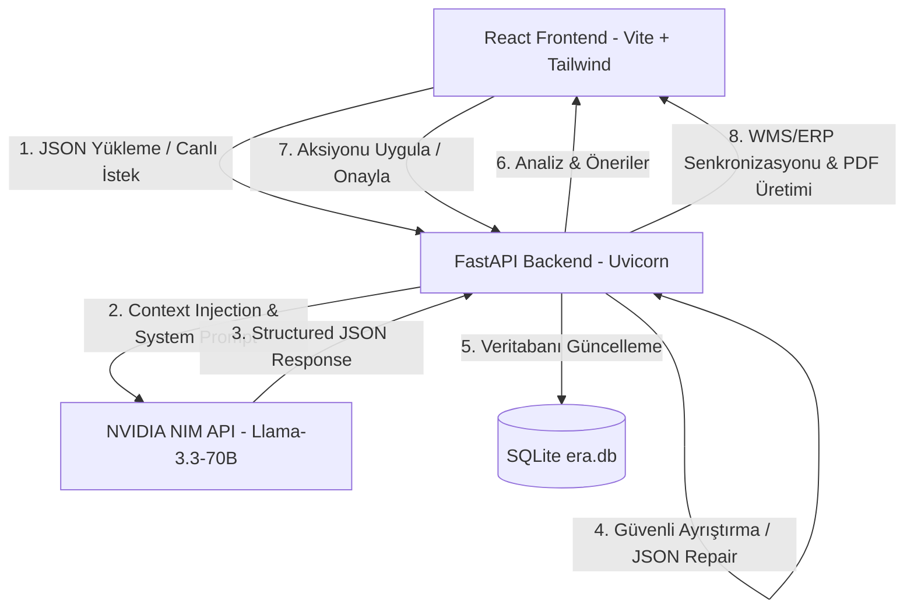

Era — AI-Powered Enterprise Logistics Optimization Platform

<p align="center">
  
  
  
  
  
</p>

---

## 🌟 Proje Özeti / Executive Summary

**Era**, modern tedarik zinciri ve lojistik operasyonlarında sıkça karşılaşılan **envanter (stok) darboğazlarını** ve **sevkiyat (rota) verimsizliklerini** üretken yapay zeka (Generative AI) gücüyle anlık olarak tespit eden, optimize eden ve **aksiyon alınabilir (actionable)** çözümler sunan uçtan uca akıllı bir operasyon yönetim platformudur. 

Geleneksel karar destek sistemleri sadece geçmiş veriyi raporlarken (Reaktif), **Era** entegre yapay zeka copilot'ı ile geleceğe yönelik risk tahmini yapar ve tek tıkla WMS/ERP sistemlerine işlenebilecek proaktif aksiyonlar önerir (Proaktif & Ajan Yapılı).

---

## 🎯 Hackathon Temaları ve Çözüm Uyum Matrisi

| Tema Kodu | Tema Başlığı | Era Platformundaki Karşılığı ve Çözüm Odakları |
| :---: | :--- | :--- |
| **A1** | **Verimlilik & Maliyet Optimizasyonu** | Stok devir hızını optimize eder. Depolar arası gereksiz transferleri engeller, lojistik durak sürelerini kısaltarak yakıt ve zaman tasarrufu sağlar. |
| **B2** | **Kamuda AI Dönüşümü** | Afet yönetim merkezleri, kamu depoları (örn: Kızılay, AFAD, Devlet Malzeme Ofisi) ve dağıtım ağlarının yapay zeka ile dinamik, esnek ve şeffaf koordinasyonu. |
| **D4** | **Zaman Serisi & Talep Analizi** | Günlük talep trendlerini ve depo kurallarını (Min/Max envanter limitleri) zaman serisi mantığıyla kıyaslayarak envanter tükenme sürelerini milisaniyeler içinde simüle eder. |
| **D5** | **Anomali Tespiti & Erken Uyarı** | Teslimat rotalarında hedef sürelerin aşılması (trafik/durak anomalileri) ve depolardaki kritik stok seviyelerini dinamik kurallar çerçevesinde anlık anomali olarak yakalar. |

---

## 🛠️ Temel Yetenekler ve Özellikler (Core Features)

Era, basit bir yapay zeka chatbot arayüzünün çok ötesinde, tam entegre bir **Lojistik Operasyon Hub'ı**dır:

### 1. 🌅 Morning Brief (Dinamik Sabah Özeti)
Yönetici sisteme giriş yaptığında, AI tarafından üretilmiş ve doğrudan ilgili yöneticiye hitap eden (örn: *"Günaydın Ahmet Bey..."*), o günkü operasyonel risk puanını özetleyen ve alınması gereken en kritik 2 proaktif aksiyonu sunan doğal dilde yazılmış dinamik bir karşılama metni.

### 2. 💬 Era-Co Chat & Omni Search (Doğal Dil Arama Motoru)
Statik SQL veya if-else sorguları yerine, tamamen canlı envanter ve rota verisiyle beslenmiş (Context Injection) yapay zeka destekli arama çubuğu. 
* *Örn Sorgu:* *"Erzurum deposundaki yedek parça durumumuz nedir?"* veya *"Maliyet tasarrufu potansiyelimiz ne kadar?"* sorularına anlık, analitik ve doğru yanıtlar üretir.

### 3. ⚡ Actionable AI & Proactive Alerts (Aksiyon Alabilir Öneriler)
Yapay zekanın ürettiği kararlar sadece statik birer tavsiye olarak kalmaz. Arayüzdeki **"Uygula" (Apply)** butonuna tıklandığında:
* Karar API üzerinden işlenir.
* Veritabanında (WMS/ERP simülasyonu) ilgili stok transferleri veya rota düzenlemeleri güncellenir.
* Durum **"Uygulandı"** olarak işaretlenerek sisteme operasyonel bir iz (audit log) bırakılır.

### 4. 🔀 Operasyonel Yol Haritası (Execution Roadmap)
Bir AI önerisi onaylandığında, arka planda çalışan süreçlerin (API çağrıları, WMS senkronizasyonu, RLHF geri bildirim güncellemeleri ve veritabanı yazımları) anlık durumunu görselleştiren step-by-step bir süreç takip hattı (Roadmap). Bu sayede yapay zekaya duyulan güven ve operasyonel şeffaflık maksimize edilir.

### 5. 📄 Tek Tıkla PDF İhracı (Enterprise Reporting)
Tüm AI analiz sonuçları, sabah brifingi, anomali raporları ve uygulanan operasyonel kararlar `html2pdf.js` kütüphanesi sayesinde tek tıkla kurumsal ve şık bir PDF raporuna dönüştürülüp indirilebilir.

### 6. 🚆 Train Loading & Lojistik Animasyonları
Veri yükleme, analiz etme veya JSON yükleme esnasında kullanıcının sıkılmasını engelleyen, lojistik temasına uygun, custom tasarlanmış tren yükleme animasyonu.

---

## 🏗️ Sistem Mimarisi & Veri Akışı (Architecture)

Era, modern mikrosistem mimarisine ve **Human-in-the-Loop** (İnsan Onaylı Otonom Yapı) prensibine dayanır:



### 🛡️ Endüstriyel Seviye Güvenlik Duvarı & Hata Toleransı (Resilience)
Dil modellerinin uydurma (halüsinasyon) eğilimini ve JSON bozma risklerini minimize etmek için Era arkasında güçlü bir **yazılım mühendisliği savunması** barındırır:
1. **Strict Prompting:** Sistem promptunda modele sadece doğrulanabilir kurallar enjekte edilir.
2. **Context Window Limitations:** Şirketin Min/Max envanter kuralları modele sınır parametreleri olarak gönderilir.
3. **JSON Repairing (`_repair_json`):** Modelden dönen JSON yapısında kaçan virgüller, hatalı parantezler regex algoritmalarıyla otomatik onarılır.
4. **Resilient Fallback:** NVIDIA API limit aşımı veya internet kesintilerinde deterministik yedek algoritmalar (`_fallback_suggestions` ve `_fallback_insights`) devreye girerek sistemin operasyonel sürekliliğini garanti eder. Çökme yaşanmaz!

---

## 📁 Proje Klasör Yapısı (Project Directory)

```
.
├── backend/                  # Python FastAPI API & Servisleri
│   ├── config.py             # NVIDIA API Key ve Model Yapılandırmaları
│   ├── main.py               # API Başlangıç Noktası (Uvicorn Server)
│   ├── middleware.py         # CORS ve Güvenlik Ayarları
│   ├── schemas.py            # API Pydantic Şemaları
│   ├── storage.py            # SQLite DB (era.db) Entegrasyonu & CRUD
│   ├── requirements.txt      # Python Bağımlılıkları
│   ├── routers/
│   │   └── operations.py     # Lojistik API Endpoint'leri (/analyze, /apply...)
│   └── services/
│       └── ai_service.py     # NVIDIA NIM API Llama-3 Entegrasyonu & Fallback
│
└── frontend/                 # React SPA
    ├── package.json          # Node Bağımlılıkları
    ├── tailwind.config.js    # Tailwind Tasarım Ayarları
    └── src/
        ├── App.jsx           # Orchestration Layer
        ├── main.jsx          # Giriş Noktası
        ├── index.css         # CSS & Global Tasarım Token'ları
        ├── pages/
        │   ├── Landing.jsx   # Premium Karşılama ve Değer Önerisi Sayfası
        │   └── Dashboard.jsx # Ana Operasyon Kontrol Paneli
        ├── components/
        │   ├── ExecutiveSummary.jsx # KPI ve Verimlilik Kartları
        │   ├── SuggestionCard.jsx   # AI Önerisi ve Yol Haritası Kartları
        │   ├── TrainLoading.jsx     # Özelleştirilmiş Tren Animasyon Ekranı
        │   ├── AiInsightsPanel.jsx  # AI Operasyon Log Paneli
        │   └── Navbar.jsx           # Premium Navigasyon
        └── features/
            └── copilot/
                ├── CopilotBrief.jsx # Morning Brief Karşılama Alanı
                ├── OmniSearchBar.jsx# Doğal Dil Arama Arayüzü
                └── ProactiveAlert.jsx# Acil Anomali Uyarı Kartları
```

---

## 🚀 Hızlı Kurulum & Çalıştırma (Quick Start Guide)

### 📋 Gereksinimler
* **Python:** v3.10 veya üzeri
* **Node.js:** v18.0 veya üzeri
* **NVIDIA NIM API Key:** Lojistik AI analizi için gereklidir (Bulunmadığı takdirde sistem deterministik Fallback modunda demo verileriyle çalışır).

---

### 1️⃣ Arka Plan (Backend) Kurulumu

1. `backend` klasörüne geçiş yapın:
   ```bash
   cd backend
   ```

2. Python sanal ortamı oluşturun ve aktif edin:
   ```bash
   python -m venv venv
   source venv/bin/activate  # macOS/Linux için
   # veya
   venv\Scripts\activate     # Windows için
   ```

3. Gerekli kütüphaneleri yükleyin:
   ```bash
   pip install -r requirements.txt
   ```

4. Çevre değişkenlerini yapılandırın:
   * `backend/` dizini altındaki `.env.example` dosyasını kopyalayıp adını `.env` yapın.
   * Dosya içerisine NVIDIA API Key değerinizi ekleyin:
     ```env
     NVIDIA_API_KEY=nvapi-your-real-key-here
     ```

5. Sunucuyu başlatın:
   ```bash
   python main.py
   ```
   * Backend API şu adreste çalışacaktır: `http://localhost:8000`
   * API dökümantasyonu (Swagger): `http://localhost:8000/docs`

---

### 2️⃣ Arayüz (Frontend) Kurulumu

1. `frontend` klasörüne geçiş yapın:
   ```bash
   cd ../frontend
   ```

2. Gerekli Node modüllerini yükleyin:
   ```bash
   npm install
   ```

3. Arayüzü geliştirme modunda başlatın:
   ```bash
   npm run dev
   ```
   * Arayüz uygulaması şu adreste çalışacaktır: `http://localhost:5173`
   * Frontend, backend isteklerini otomatik olarak `/api` proxy'si üzerinden `http://localhost:8000` adresine yönlendirecektir.

---

## 📊 Örnek Veri Şeması (sample-data.json)

Sisteme yükleyip anında analiz başlatabileceğiniz örnek veri yapısı envanter, rotalar ve şirket kurallarını barındıran şu JSON formatındadır:

```json
{
  "stock": [
    {
      "product_id": "Endüstriyel Yedek Parça",
      "warehouse": "Erzurum Doğu Deposu",
      "qty": 5,
      "daily_demand": 3
    },
    {
      "product_id": "Tıbbi Malzeme",
      "warehouse": "İstanbul Merkez Deposu",
      "qty": 12,
      "daily_demand": 5
    }
  ],
  "routes": [
    {
      "route_id": "R-IST-ANK",
      "stops": 8,
      "distance_km": 450,
      "avg_time_hours": 5.8
    },
    {
      "route_id": "R-ERZ-ANK",
      "stops": 4,
      "distance_km": 880,
      "avg_time_hours": 10.5
    }
  ],
  "company_rules": {
    "min_stock_days": 3,
    "max_stock_days": 14,
    "target_delivery_hours": 3.5
  }
}
```

---

## 🔮 Gelecek Yol Haritası & Kurumsal Vizyon

1. **🤖 Tam Otonom Lojistik Ajanı (Fully Autonomous Agent):**
   * *Mevcut Yapı:* Human-in-the-loop (İnsan onaylı AI kararı).
   * *Gelecek Hedefi:* Belirli bir güven skorunun üzerindeki kararları doğrudan PTT Kargo, Yurtiçi Kargo API'leri veya depo WMS API'leri üzerinden hiçbir insan müdahalesi olmadan tetikleme yeteneği.
2. **📈 İleri Zaman Serisi Entegrasyonları (D4):**
   * Mevcut envanter kuralları yerine LSTM veya Prophet modelleri entegre edilerek mevsimsel talep tahminlerinin (örn: kış aylarında Erzurum deposundaki parça talebinin artması) yapay zekaya otomatik girdi olarak sunulması.
3. **🗺️ Canlı GPS & IoT Takibi (D5):**
   * Rotalardaki taşıtların IoT cihazlarından gelen anlık GPS koordinatlarını işleyerek, rota verimsizliğini statik ortalama saatler üzerinden değil, canlı trafik anomalileri üzerinden tespit etme.

---

## ⚖️ Lisans

Bu proje **MIT Lisansı** altında lisanslanmıştır. Daha fazla detay için `LICENSE` dosyasına göz atabilirsiniz.

---

<p align="center">
  <b>Era Platformu</b> — Lojistikte Yapay Zeka ile Geleceği Bugünden Yönetin.
</p>

