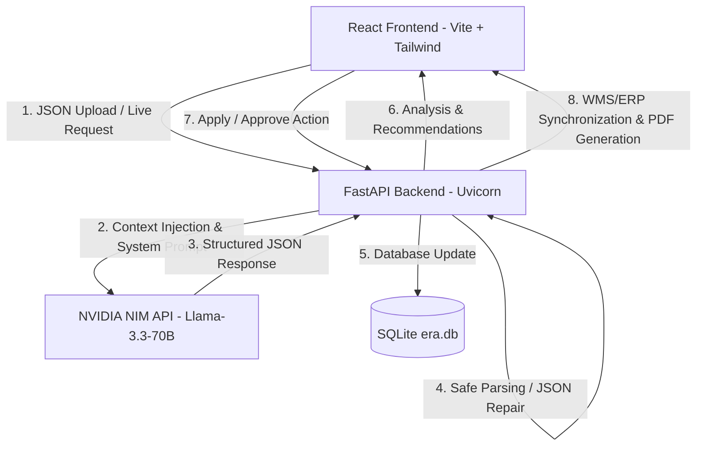

# Era — AI-Powered Enterprise Logistics Optimization Platform

<p align="center">
  
  
  
  
  
</p>

---

## 🌟 Executive Summary

**Era** is an AI-powered logistics operations platform designed to address **inventory bottlenecks** and **shipment inefficiencies** commonly encountered in modern supply chain and logistics operations.

While traditional decision-support systems only report historical data (reactive), **Era** uses its integrated AI copilot to predict future risks and send approved decisions to WMS/ERP systems with a single click.

---

## 🎯 Hackathon Themes and Solution Alignment Matrix

| Theme Code | Theme | How It Is Addressed by the Era Platform |
| :---: | :--- | :--- |
| **A1** | **Efficiency & Cost Optimization** | Optimizes inventory turnover, prevents unnecessary transfers between warehouses, and saves fuel and time by reducing logistics stop durations. |
| **B2** | **AI Transformation in the Public Sector** | Enables dynamic, flexible, and transparent AI-powered coordination of distribution networks such as PTT. |
| **D4** | **Time Series & Demand Analysis** | Compares daily demand trends with warehouse rules (minimum/maximum inventory limits) to estimate inventory depletion times. |
| **D5** | **Anomaly Detection & Early Warning** | Detects delivery routes exceeding target times (traffic/stop anomalies) and critical warehouse stock levels using dynamic rules. |

---

## 🛠️ Core Capabilities and Features

Era is much more than a basic AI chatbot interface; it is a fully integrated **Logistics Operations Hub**:

### 1. 🌅 Morning Brief (Dynamic Morning Summary)

A dynamic natural-language welcome message that summarizes the day's operational risk score and presents the two most critical proactive actions that should be taken.

### 2. 💬 Era-Co Chat & Omni Search (Natural-Language Search Engine)

An AI-powered search bar supplied with live inventory and route data through context injection, rather than relying on static SQL or if/else queries.

* *Example queries:* *"What is the status of spare parts at the Erzurum warehouse?"* or *"How much cost-saving potential do we have?"* The system produces immediate, analytical, and accurate answers.

### 3. ⚡ Actionable AI & Proactive Alerts

AI-generated decisions do not remain static recommendations. When the **Apply** button in the interface is clicked:

* The decision is processed through the API.
* Relevant inventory transfers or route adjustments are updated in the database (the WMS/ERP simulation).
* The decision is marked as **Applied**, leaving an operational trace in the system as an audit log.

### 4. 🔀 Operational Execution Roadmap

When an AI recommendation is approved, the interface visualizes the real-time status of background processes, including API calls, WMS synchronization, RLHF feedback updates, and database writes.

### 5. 📄 One-Click PDF Export (Enterprise Reporting)

All AI analysis results, the morning briefing, anomaly reports, and applied operational decisions can be converted into a polished enterprise PDF report with a single click using the `html2pdf.js` library.

### 6. 🚆 Train Loading & Logistics Animations

A custom-designed train-loading animation, aligned with the logistics theme, keeps users engaged while data is loading, being analyzed, or uploaded as JSON.

---

## 🏗️ System Architecture & Data Flow

Era is based on a modern microsystem architecture and the **Human-in-the-Loop** principle:


```mermaid
graph TD
    A[React Frontend - Vite + Tailwind] -- 1. JSON Upload / Live Request --> B[FastAPI Backend - Uvicorn]
    B -- 2. Context Injection & System Prompt --> C[NVIDIA NIM API - Llama-3.3-70B]
    C -- 3. Structured JSON Response --> B
    B -- 4. Safe Parsing / JSON Repair --> B
    B -- 5. Database Update --> D[(SQLite era.db)]
    B -- 6. Analysis & Recommendations --> A
    A -- 7. Apply / Approve Action --> B
    B -- 8. WMS/ERP Synchronization & PDF Generation --> A
```

### 🛡️ Industrial-Grade Resilience & Fault Tolerance

To minimize language-model hallucinations and the risk of malformed JSON, Era includes a strong software-engineering defense layer:

1. **Strict Prompting:** Only verifiable rules are injected into the system prompt.
2. **Context Window Limitations:** The company's minimum/maximum inventory rules are sent to the model as boundary parameters.
3. **JSON Repairing (`_repair_json`):** Missing commas and malformed brackets in the JSON returned by the model are automatically repaired using regular-expression algorithms.
4. **Resilient Fallback:** If the NVIDIA API rate limit is exceeded or the internet connection is unavailable, deterministic fallback algorithms (`_fallback_suggestions` and `_fallback_insights`) keep the system operational.

---

## 📁 Project Directory

```
.
├── backend/                  # Python FastAPI API & services
│   ├── config.py             # NVIDIA API key and model configuration
│   ├── main.py               # API entry point (Uvicorn server)
│   ├── middleware.py         # CORS and security settings
│   ├── schemas.py            # API Pydantic schemas
│   ├── storage.py            # SQLite database (era.db) integration & CRUD
│   ├── requirements.txt      # Python dependencies
│   ├── routers/
│   │   └── operations.py     # Logistics API endpoints (/analyze, /apply...)
│   └── services/
│       └── ai_service.py     # NVIDIA NIM API Llama-3 integration & fallback
│
└── frontend/                 # React SPA
    ├── package.json          # Node dependencies
    ├── tailwind.config.js    # Tailwind design configuration
    └── src/
        ├── App.jsx           # Orchestration layer
        ├── main.jsx          # Entry point
        ├── index.css         # CSS & global design tokens
        ├── pages/
        │   ├── Landing.jsx   # Premium welcome and value proposition page
        │   └── Dashboard.jsx # Main operations control panel
        ├── components/
        │   ├── ExecutiveSummary.jsx # KPI and efficiency cards
        │   ├── SuggestionCard.jsx   # AI recommendation and roadmap cards
        │   ├── TrainLoading.jsx     # Custom train-loading animation screen
        │   ├── AiInsightsPanel.jsx  # AI operations log panel
        │   └── Navbar.jsx           # Premium navigation
        └── features/
            └── copilot/
                ├── CopilotBrief.jsx # Morning Brief welcome area
                ├── OmniSearchBar.jsx# Natural-language search interface
                └── ProactiveAlert.jsx# Urgent anomaly alert cards
```

---

## 🚀 Quick Start Guide

### 📋 Requirements

* **Python:** v3.10 or later
* **Node.js:** v18.0 or later
* **NVIDIA NIM API Key:** Required for logistics AI analysis. If unavailable, the system runs in deterministic fallback mode with demo data.

---

### 1️⃣ Backend Setup

1. Navigate to the `backend` directory:
   ```bash
   cd backend
   ```

2. Create and activate a Python virtual environment:
   ```bash
   python -m venv venv
   source venv/bin/activate  # macOS/Linux
   # or
   venv\Scripts\activate     # Windows
   ```

3. Install the required packages:
   ```bash
   pip install -r requirements.txt
   ```

4. Configure the environment variables:
   * Copy the `.env.example` file in the `backend/` directory and rename it to `.env`.
   * Add your NVIDIA API key to the file:
     ```env
     NVIDIA_API_KEY=nvapi-your-real-key-here
     ```

5. Start the server:
   ```bash
   python main.py
   ```
   * The backend API will be available at `http://localhost:8000`.
   * API documentation (Swagger): `http://localhost:8000/docs`

---

### 2️⃣ Frontend Setup

1. Navigate to the `frontend` directory:
   ```bash
   cd ../frontend
   ```

2. Install the required Node modules:
   ```bash
   npm install
   ```

3. Start the interface in development mode:
   ```bash
   npm run dev
   ```
   * The frontend application will be available at `http://localhost:5173`.
   * The frontend automatically routes backend requests through the `/api` proxy to `http://localhost:8000`.

---

## 📊 Example Data Schema (`sample-data.json`)

The following JSON format contains inventory, routes, and company rules. You can upload it to the system and start an analysis immediately:

```json
{
  "stock": [
    {
      "product_id": "Industrial Spare Part",
      "warehouse": "Erzurum East Warehouse",
      "qty": 5,
      "daily_demand": 3
    },
    {
      "product_id": "Medical Supplies",
      "warehouse": "Istanbul Central Warehouse",
      "qty": 12,
      "daily_demand": 5
    }
  ],
  "routes": [
    {
      "route_id": "R-IST-ANK",
      "stops": 8,
      "distance_km": 450,
      "avg_time_hours": 5.8
    },
    {
      "route_id": "R-ERZ-ANK",
      "stops": 4,
      "distance_km": 880,
      "avg_time_hours": 10.5
    }
  ],
  "company_rules": {
    "min_stock_days": 3,
    "max_stock_days": 14,
    "target_delivery_hours": 3.5
  }
}
```

---

## 🔮 Future Roadmap & Corporate Vision

1. **🤖 Fully Autonomous Logistics Agent:**
   * *Current architecture:* Human-in-the-loop (human-approved AI decisions).
   * *Future goal:* Trigger decisions above a defined confidence score directly through PTT Cargo, Yurtiçi Kargo, or warehouse WMS APIs without human intervention.
2. **📈 Advanced Time-Series Integrations (D4):**
   * Integrate LSTM or Prophet models instead of relying only on current inventory rules, enabling the AI to account for seasonal demand forecasts (for example, increased spare-part demand at the Erzurum warehouse during winter).
3. **🗺️ Live GPS & IoT Tracking (D5):**
   * Process real-time GPS coordinates from IoT devices installed in vehicles, enabling route inefficiencies to be detected through live traffic anomalies instead of static average travel times.

---

## ⚖️ License

This project is licensed under the **MIT License**. See the `LICENSE` file for more details.

---

<p align="center">
  <b>Era Platform</b> — Manage the future of logistics with AI, today.
</p>
